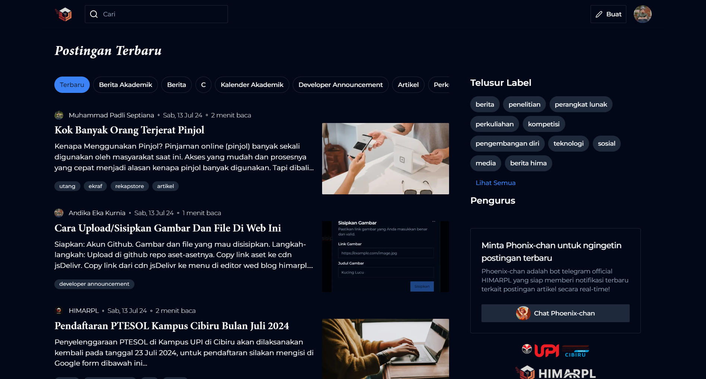

{/* ! When translating this file, please add ../ to the image path ! */}

[blog.himarpl.org](https://blog.himarpl.org) adalah platform blog resmi untuk anggota HIMARPL (Himpunan Mahasiswa Rekayasa Perangkat Lunak). Website ini dibangun menggunakan Next.js dengan T3 Stack dan dilengkapi dengan rich text editor yang didukung oleh TipTap.

## Fitur Utama

- Rich Text Editor dengan Interface WYSIWYG
- Otentikasi & Otorisasi Pengguna
- Organisasi Artikel Berbasis Tag
- Pemuatan Artikel dengan Infinite Scroll
- Fungsionalitas Pencarian
- Desain Responsif
- Dukungan Tema Gelap/Terang
- Berbagi Media Sosial
- Integrasi Analitik

## Library yang Digunakan

**Dependensi Inti**
- Next.js (^14.2.4)
- React (18.2.0)
- React DOM (18.2.0)
- TypeScript (^5.4.2)

**Otentikasi & Basis Data**
- NextAuth (^4.24.6)
- Prisma (@prisma/client ^5.16.0)
- tRPC (@trpc/client, @trpc/next, @trpc/react-query, @trpc/server ^10.45.1)

**Editor & Konten**
- TipTap (@tiptap/react ^2.2.4)
- TipTap Extensions (berbagai paket @tiptap/*)
- HTML React Parser (^5.1.10)

**UI & Styling**
- Komponen Radix UI (berbagai komponen @radix-ui/*)
- Tailwind CSS (^3.4.1)
- Tailwind Typography (@tailwindcss/typography ^0.5.12)
- Framer Motion (^11.2.12)
- Embla Carousel (embla-carousel-react ^8.1.5)
- Lucide React Icons (^0.363.0)
- React Simple Icons (@icons-pack/react-simple-icons ^9.4.0)

**Manajemen Form & State**
- React Hook Form (^7.52.0)
- React Select (^5.8.0)
- Zod (^3.23.8)

**Utilitas**
- Moment (^2.30.1)
- Sharp (^0.33.3)
- PostHog Analytics (posthog-js ^1.146.2)
- Next Themes (^0.3.0)
- Use Debounce (^10.0.0)

**Alat Pengembangan**
- ESLint (^8.57.0)
- Prettier (^3.2.5)
- Jest (^29.7.0)
- Berbagai plugin dan konfigurasi ESLint

## Dukungan

Untuk pertanyaan atau masalah:

- [GitHub Issues](https://github.com/himarplupi/blog-himarpl/issues)
- Hubungi Departemen Kominfo HIMARPL
- Kunjungi [himarpl.org](https://www.himarpl.org)

## Lisensi

Proyek ini dilisensikan di bawah Lisensi MIT - lihat file [LICENSE](https://github.com/himarplupi/blog-himarpl/blob/main/LICENSE) untuk detailnya.
