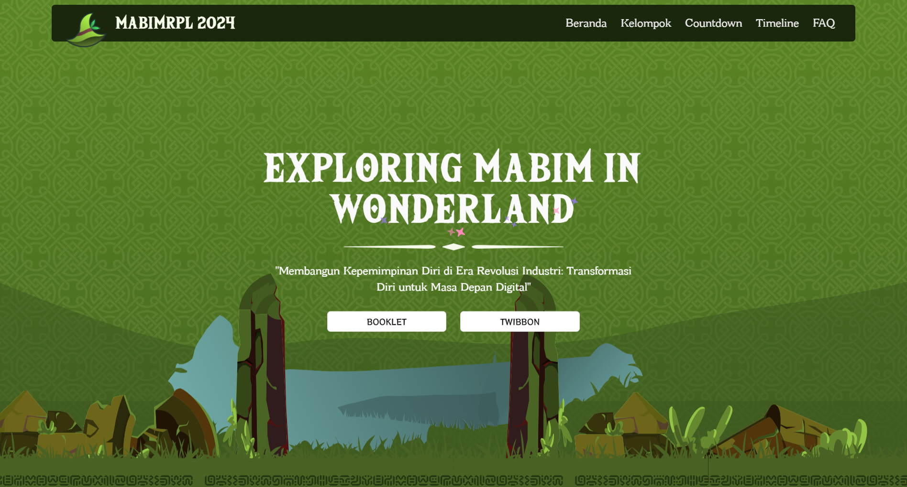

import { Tabs, TabItem } from "@astrojs/starlight/components";
import { Steps } from "@astrojs/starlight/components";
import { Code } from "@astrojs/starlight/components";

{/* ! When translating this file, please add ../ to the image path ! */}


[mabim.himarpl.com](https://mabim.himarpl.com) adalah website pertama dan satu-satunya oleh HIMARPL untuk memberikan informasi tentang Masa Bimbingan RPL (Program Orientasi Mahasiswa) di UPI. Website ini dibangun menggunakan NextJS.

## Fitur Utama

- Bagian Hero Interaktif dengan Elemen Animasi
- Sistem Informasi Grup/Mentor Dinamis
- Timeline Acara & Countdown
- Bagian FAQ
- Showcase Sponsor & Media Partner
- Navigasi Responsif
- Scrolling & Animasi yang Halus
- Integrasi Analitik

## Dependensi Inti

**Framework & Runtime**

- NextJS
- Next Themes
- PostHog
- React
- React DOM

**Komponen UI & Styling**
- Komponen Radix UI (Berbagai paket @radix-ui/*)
- Tailwind CSS dengan Konfigurasi Khusus
- Framer Motion untuk Animasi
- Komponen Shadcn UI
- Komponen Bertema Medieval Kustom

**Desain & Animasi**

- Embla Carousel Autoplay
- Embla Carousel React
- Framer Motion
- Lenis

**Optimisasi Aset**

- Sharp

**Manajemen State & Utilitas**
- PostHog untuk Analitik
- Class Variance Authority & clsx untuk Dynamic Styling
- Zod untuk Validasi Tipe

## Struktur Proyek

- `/src/components/common` - Komponen inti
- `/src/components/ui` - Komponen UI yang dapat digunakan kembali
- `/src/components/ornament` - Elemen dekoratif
- `/src/assets` - Aset statis dan gambar
- `/src/styles` - Gaya global dan konfigurasi Tailwind

## Setup Pengembangan Lokal

Panduan ini akan memandu Anda melalui pengaturan lingkungan pengembangan lokal untuk website Mabim HIMARPL.

### Prasyarat

Sebelum menginstal aplikasi, pastikan Anda memiliki:

1. [Node.js](https://nodejs.org/en) dan [npm](https://www.npmjs.com/) terinstal
2. [Git](https://git-scm.com/) terinstal

### Langkah Setup

<Steps>

1. Fork dan clone repositori:

   <Tabs>
     <TabItem label="HTTPS">
       <Code
         code={`git clone https://github.com/himarplupi/mabim-himarpl.git`}
         lang="bash"
         title="HTTPS"
       />
     </TabItem>
     <TabItem label="SSH">
       <Code
         code={`git clone git@github.com:himarplupi/mabim-himarpl.git`}
         lang="bash"
         title="SSH"
       />
     </TabItem>
     <TabItem label="GitHub CLI">
       <Code
         code={`gh repo clone himarplupi/mabim-himarpl`}
         lang="bash"
         title="GitHub CLI"
       />
     </TabItem>
   </Tabs>

2. Navigasi ke direktori proyek:

   ```bash
   cd mabim-himarpl
   ```

3. Setup remote upstream:

   <Tabs>
     <TabItem label="HTTPS">
       <Code
         code={`git remote add upstream https://github.com/himarplupi/mabim-himarpl.git`}
         lang="bash"
         title="HTTPS"
       />
     </TabItem>
     <TabItem label="SSH">
       <Code
         code={`git remote add upstream git@github.com:himarplupi/mabim-himarpl.git`}
         lang="bash"
         title="SSH"
       />
     </TabItem>
     <TabItem label="GitHub CLI">
       <Code
         code={`gh repo sync himarplupi/mabim-himarpl`}
         lang="bash"
         title="GitHub CLI"
       />
     </TabItem>
   </Tabs>

4. Instal dependensi dan mulai server pengembangan:

   ```bash
   npm ci              # Instal dependensi
   npm run dev         # Mulai server pengembangan
   ```

   Aplikasi sekarang harus berjalan di `http://localhost:3000`.

5. Buat branch baru untuk perubahan Anda:

   ```bash
   git checkout -b my-feature-branch
   ```

6. Setelah Anda puas dengan perubahan Anda, tambahkan dan commit ke branch Anda, lalu push branch Anda ke fork Anda.

   ```bash
   git add .
   git commit # Silakan ikuti pedoman commit di bawah ini   
   git push -u origin my-feature-branch
   ```

   :::note[PENTING]
    Sebelum melakukan commit dan membuka Pull Request, silakan baca [Pedoman Commit](/id/getting-started/05-contribution-guide/#commit-guidelines) dan [Kebijakan Pull Request](/id/getting-started/05-contribution-guide/#pull-request-policy) di bawah ini.
   :::

7. Buat Pull Request.
   :::note[CATATAN]
    Kami meminta penulis PR untuk menghindari rebasing/memperbarui PR mereka dengan branch `main` secara tidak perlu.
   :::
</Steps>

### Script yang Tersedia

- `npm run dev` - Memulai server pengembangan dengan hot reload
- `npm run build` - Membuat build produksi
- `npm run start` - Memulai server produksi
- `npm run lint` - Menjalankan pemeriksaan linting

## Migrasi Masa Depan

Baca [perencanaan masa depan tentang manajemen domain](../../getting-started/04-staff-guide/#future-planning) untuk informasi lebih lanjut tentang website `mabim-himarpl` ini. Setelah migrasi, website ini akan diarsipkan dan domain `mabim.himarpl.com` akan digunakan untuk website Mabim yang baru.

## Dukungan

Untuk pertanyaan atau masalah:

- [GitHub Issues](https://github.com/himarplupi/mabim-himarpl/issues)
- Hubungi Departemen Kominfo HIMARPL
- Kunjungi [himarpl.com](https://www.himarpl.com)

## Lisensi

Proyek ini dilisensikan di bawah Lisensi MIT - lihat file [LICENSE](https://github.com/himarplupi/mabim-himarpl/blob/main/LICENSE) untuk detailnya.
