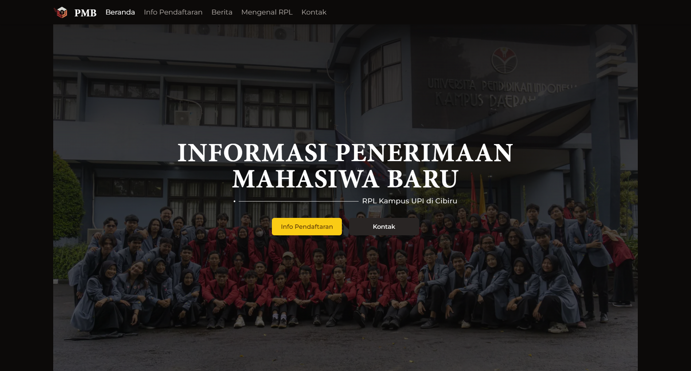

{/* ! When translating this file, please add ../ to the image path ! */}

[pmb.himarpl.com](https://pmb.himarpl.com) adalah website resmi oleh HIMARPL (Himpunan Mahasiswa Rekayasa Perangkat Lunak) untuk memberikan informasi tentang penerimaan mahasiswa baru di program Rekayasa Perangkat Lunak UPI. Website ini dibangun menggunakan Next.js dan mengikuti arsitektur T3 Stack.

## Fitur Utama

- Halaman Informasi Dinamis untuk Jalur Penerimaan yang Berbeda (SNBP, SNBT, SM-UPI)
- Integrasi Berita Terbaru dengan Platform Blog
- Sistem Informasi Kontak
- Halaman Informasi Program
- Desain Responsif
- Optimisasi SEO
- Integrasi Analitik

## Dependensi Inti

**Framework & Runtime**
- Next.js (^14.2.4)
- React (18.2.0)
- TypeScript (^5.4.2)

**Manajemen Data & API**
- tRPC (@trpc/client, @trpc/next, @trpc/react-query, @trpc/server)
- Prisma (@prisma/client ^5.16.0)
- Zod (^3.22.4)

**Komponen UI & Styling**
- Radix UI (Berbagai komponen @radix-ui/*)
- Tailwind CSS (^3.4.1)
- Tailwind Typography (@tailwindcss/typography)
- Framer Motion (^11.2.12)
- Lucide React (^0.363.0)
- React Simple Icons (@icons-pack/react-simple-icons)

**Utilitas & Enhancement**
- Moment (^2.30.1) - Format tanggal
- Sharp (^0.33.3) - Optimisasi gambar
- PostHog (posthog-js) - Analitik
- HTML React Parser (^5.1.9) - Parsing konten
- Next Themes (^0.3.0) - Manajemen tema

## Dukungan

Untuk pertanyaan atau masalah:

- [GitHub Issues](https://github.com/himarplupi/pmb-himarpl/issues)
- Hubungi Departemen Kominfo HIMARPL
- Kunjungi [himarpl.com](https://www.himarpl.com)

## Lisensi

Proyek ini dilisensikan di bawah Lisensi MIT - lihat file [LICENSE](https://github.com/himarplupi/pmb-himarpl/blob/main/LICENSE) untuk detailnya.
